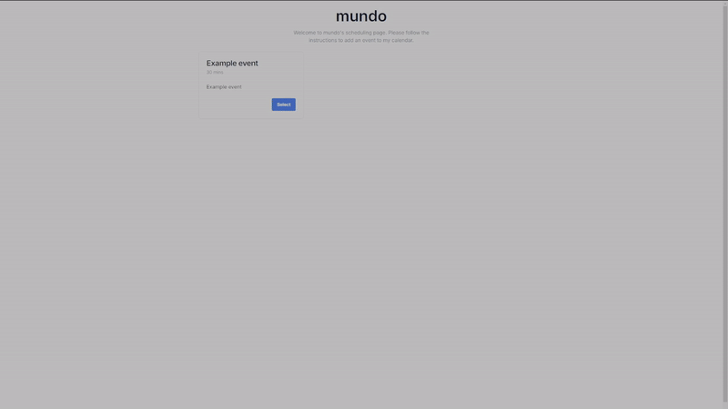

# Next.js Calendar Scheduler App with Google Calendar Integration

Highlighting the use of Next.js, Tailwind, Shadcn, Neon, Drizzle, Zod, Clerk Auth, and Google Calendar.

This application allows users to create their own availability schedules and set up events that can be booked by others. Event bookings seamlessly integrate with the host's Google Calendar, ensuring that no events overlap.

Requires [Clerk](https://clerk.com/), [Neon](https://console.neon.tech/), [Google OAuth](https://developers.google.com/identity/protocols/oauth2) (w/calendar scopes) environment keys.

Make sure to rename ~~.env.example~~ --> .env.local, and fill out the environmental keys before launching.

# Demo

#### /login


#### /events


#### /schedule


#### /booking


Clone repository
```bash
  git clone https://github.com/9bn1dyp/calendar-app.git
```

Install dependecies
```bash
  npm install
```

Launch
```bash
  npm run dev
```

